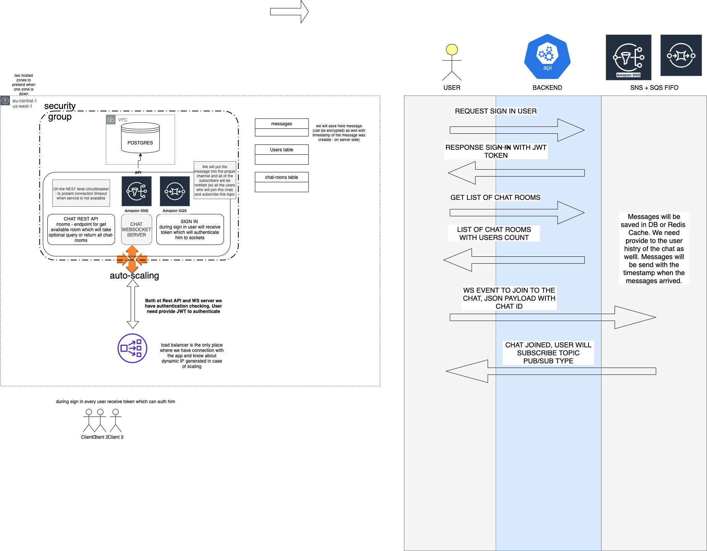

# chat-aws-architecture

## Description

The following manual will help you setting up the development environment:

1. Client will authorize to the POST `/sign-in` endpoint REST and will receive in payload token
2. To get available chat rooms auth user should GET `/chat-rooms` via REST endpoint to get possible chatRoomId and for example number of users in chat.
3. Client can connect to websocket server sending json in example format:
example payload for joining the chat 
`{ type: ‘join-room’, data: { roomId: 123 } }`
4. We can use circuit breaker in NestJS for example to detect failures from constantly recurring, during maintenance, temporary external system failure or unexpected system difficulties.
5. We will send the message from the client, but timestamp of the message will be created on the server side - it prevents scenario, when the user created timestamp of the message but let’s say has internet connection break and will create message before it was actualy send. We will save the messages to database table and add createdAt timestamp.
6. We will use at least 2 hosted zones like in the graph. In case 1 zone is unhealthy, the second one will take a role and protect us from interruption in delivery
7. For the messages we will use SNS + SQS, the first one and the second one will use SQS FIFO QUEUES so we are sure that messages will be consumed after client will retrieve connection and in the desired order, also we will have messages of creation timestamp which can be used at the front-end side to sort messages in desired order
8. Messages will be stored in DB - we want to have chat history - we can use for that cache and REDIS as well
9. I added auto-scaling from AWS which will scale application in case of larger traffic, LB will deliver request to the desired EC2 instance

## Graph

